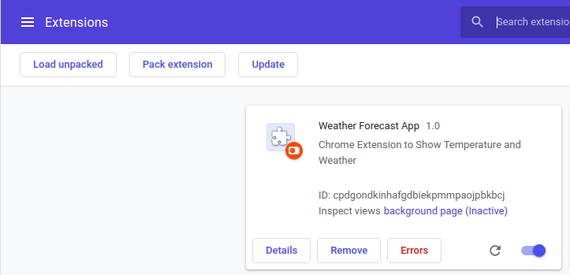
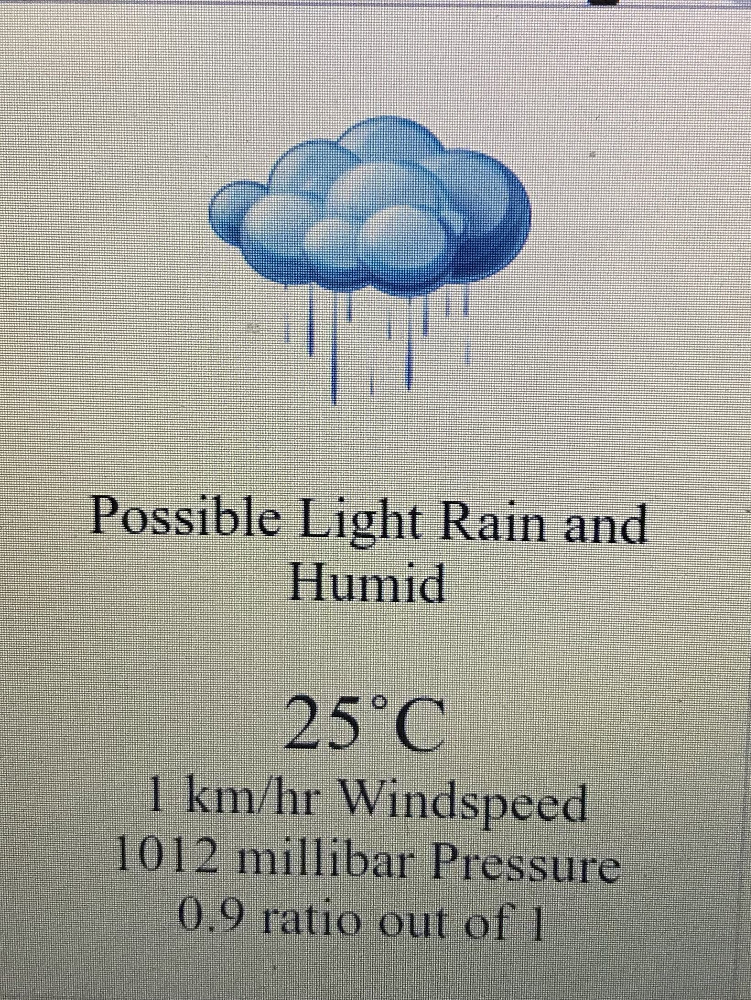

# Task ID: Chrome Extension for weather forecast

## Introduction 

Chrome Extension which uses the user's location and display's current weather situation which includes factors such as temperature, wind, pressure and humidity. This is done using the [DarkSky API](https://darksky.net/dev/docs).

**Mentor**: [Harsh Prakash Gupta](https://github.com/harshnitk17) 

## Installation:

Clone the repository :

```
https://github.com/geekswaroop/Google-DSC-2019-Submission.git
```

Navigate to the directory called **Chrome-Extension**

```
cd Google-DSC-2019-Submission
cd Chrome-Extension
```

This is where the source code is present. To use it in chrome, 

## Chrome Loading:

To load the built files into Chrome, open

```
 chrome://extensions/
```

.

Enable "Developer mode" if it's not enabled yet:


Click on "Load Unpacked"


Find the approriate location where you cloned the repo.sitory. 

After unpacking, the extension should be now at the top of the page:



Now, you will find the extension at the top of your toolbar. It will look like this depending on your location



## Contributing: 

Pull Requests are welcome. More importantly, refer the DarkSky API Docs and try implementing the following

- Weather Forecast for the entire week
- Weather alerts

## References:

1) [Basic Understanding of Extensions](https://developer.chrome.com/extensions/getstarted) 

2) [DarkSky API](https://darksky.net/dev/docs) 

3) [Replicating Sources](https://github.com/gopinav/Chrome-Extensions)

