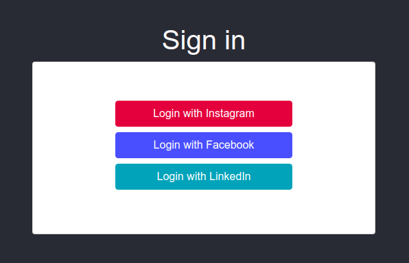
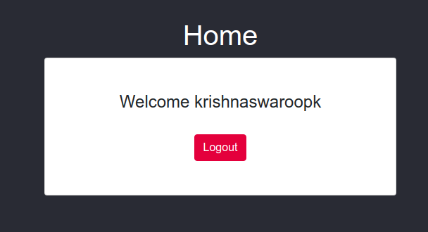
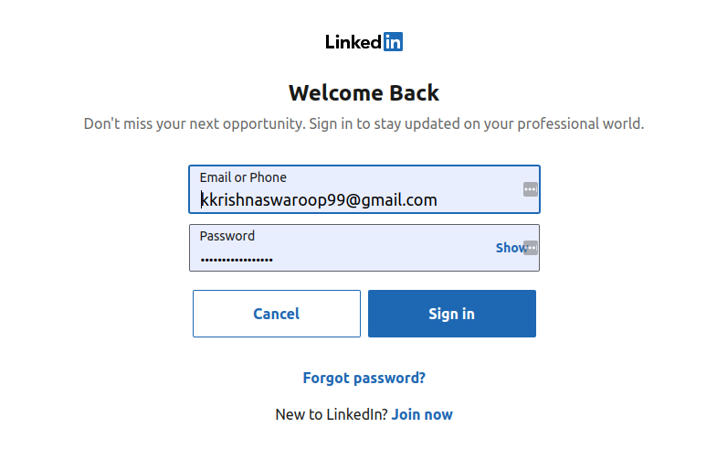

# Task ID: Social Authentication

### Introduction

Web App built on Django which showcases the social authentication of 3 Social Network Providers namely, Linkedin, Facebook and Instagram. Built using the social-auth-app-django library with minimal configuration.

**Mentor**: [Manan Poddar](https://github.com/mananpoddar)

### Requirements

- Python
- Pip

### Installation Instructions

1. Clone the project to your machine

   ```
   git clone https://github.com/geekswaroop/Google-DSC-2019-Submission.git
   ```

   

2.  Navigate into the directory

   ```
   cd Google-DSC-2019-Submission
   
   cd Social-Auth
   
   cd social_app
   ```

3.  Highly recommended you start a virtual environment now using pip. Tutorial can be found [here](https://docs.python-guide.org/dev/virtualenvs/) 

   ```
   pip install -r requirements.txt
   ```

   Run the above command to install the required packages and dependencies.

4.  Start the backend server with 

   ```
   python manage.py runserver 
   
```
   
Visit the browser at *`localhost:8000/`*
   

   
### Privacy Policy
   
The privacy policy for the apps can be found [here](https://www.termsfeed.com/privacy-policy/7c58682e74e3f9ff4c1e5c4af7cc3982) 
   
   ### Screenshots:
   
   
   
   
   
   
   
   ### References:
   
   [Django Social Authentication](https://scotch.io/tutorials/django-authentication-with-facebook-instagram-and-linkedin)
   
   
   
   **Note:**
   
   The login through Facebook is giving bugs due to it's privacy policies and it's redirect URL setup. Solution was found [here](https://stackoverflow.com/questions/11710989/facebook-privacy-policy-error) , but couldn't get enough time to implement it. 
   
   
   
   
   
   